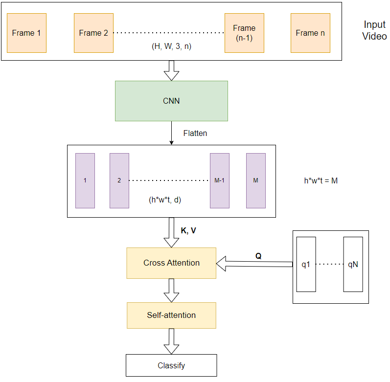

# Human Action Recognition - HMDB51 Dataset
In this repository, I propose a novel architecture combining 3DCNN and Attention Mechanism as a video classifier, and train it on [HMDB51](https://serre-lab.clps.brown.edu/resource/hmdb-a-large-human-motion-database/) dataset. The effect of adding cross attention and self attention modules was studied through ablation experiments.

The architecture based mostly on two prior arts [R(2+1)D CNN](https://arxiv.org/pdf/1711.11248v3.pdf) - factorized 3D CNN, and [Perceiver](https://arxiv.org/pdf/2103.03206.pdf) with **three motivations**:
- Enhance the learning capacity on **long temporal dependency** of videos
- Integrate **inductive bias** from convolution filters to attention
- Make the video classifiier more **computationally efficient**

## Method

The image above illustrates my proposed architecture. It contains of two main modules: CNN module and Attention module.

**CNN Module**: 
- Pretrained factorzied 3D CNN - R(2+1)D18 is used for this module.
   - It has 4 residual layers, each layer has 2 blocks of factorized 3DNN, each block has 5 CNN kernels
   - The number of layers are ablated in my experiments.

**Attention module**
- Cross attention: use **N** trainable queries to performance attention operation on the tokens from the CNN module. Complexity: $O(MN)$
- Self attention: model the interaction of tokens from cross-attention layers. Complexity: $O(N^2)$
- There are L layers of self-attention per cross-attention. The total complexity for 1 group of cross and self attention is: $O(NM + LN^2)$
 
## Compared Methods
- R(2+1)D conv: computationally efficient network with good results
- [3DCNN + BERT](https://arxiv.org/pdf/2008.01232.pdf): replace the temporal global average pooling with BERT, which is large in model size
- VideoMAE: SOTA art, fully attention based, self-supervising learning method, but heavy and need a large pretrained stage

## Experiment Result
**Ablation Study on Attention Depth**
| Architecture                                        | Train loss | Val loss | Val Acc | CNN params | Attention params |
|-----------------------------------------------------|:----------:|:--------:|:-------:|:----------:|:----------------:|
| 8 CNN blocks + 1 Cross Attention + 6 Self Attention |   0.00676  |   1.585  |  0.6673 |    31.3M   |       28.6M      |
| 8 CNN blocks + 1 Cross Attention + 2 Self Attention |   0.02675  |   1.484  |  0.6745 |    31.3M   |       11.8M      |
| 8 CNN blocks + 1 Cross Attention + 1 Self Attention |   0.1199   |   1.271  |  0.7034 |    31.3M   |       7.6M       |
| Baseline - R(2+1)D                                  |   0.5385   |   1.118  |  **0.7270** |    31.5M   |         0        |

In my initial experiments, I explore the impact of attention module size on the model's performance. From the results shown in the table, it can be observed that increasing the size of the attention module leads to higher levels of overfitting. While the training losses of the first two models approach zero, the validation losses are significantly higher compared to the baseline. As a result, the validation accuracy of the larger model is notably lower. However, when I replace the classification head of the CNN module with 1 cross attention and 1 self-attention, I obtain results that closely resemble the baseline performance.

**Ablation Study on CNN module**
| Architecture                                         | Train loss | Val loss | Val Acc | CNN params | Attention params |
|------------------------------------------------------|:----------:|:--------:|:-------:|:----------:|:----------------:|
| 8 CNN blocks + 1 Cross Attention + 1 Self Attention  |   0.1199   |   1.271  |  0.7034 |    31.3M   |       7.6M       |
| 7 CNN blocks + 1 Cross Attention + 1 Self attention  |   0.2204   |   1.856  |  0.6437 |    17.1M   |       7.6M       |
| 6 CNN blocks + 1 Cross Attention + 6 Self attention  |   0.0071   |   2.005  |  0.5827 |    7.8M    |       28.6M      |
| 4 CNN blocks + 1 Cross Attention + 6 Self attention  |   0.9097   |   2.342  |  0.4062 |    1.9M    |       28.6M      |
| 4 CNN blocks + 2 Cross Attention + 12 Self attention |    2.715   |   3.22   |  0.2815 |    1.9M    |       57.2M      |
| Baseline - R(2+1)D                                   |   0.5385   |   1.118  |  **0.7270** |    31.5M   |         0        |

The results of these experiments reveal a distinct pattern: the smaller the pretrained CNN, the poorer the overall performance. It becomes apparent that the model tends to overfit when utilizing more than 6 CNN blocks, whereas it encounters underfitting issues when employing only 4 CNN blocks, despite the attention module being larger to compensate for the model size. These findings indicate that the attention module fails to acquire substantial learning when trained on a small dataset.

**Ablation Study on Cross and Self Attention**
| Architecture                                        | Train loss | Val loss | Val Acc | CNN params | Attention params |
|-----------------------------------------------------|:----------:|:--------:|:-------:|:----------:|:----------------:|
| 8 CNN blocks + 1 Cross Attention + 1 Self Attention |   0.1199   |   1.271  |  0.7034 |    31.3M   |       7.6M       |
| 8 CNN blocks + 1 Cross Attention                    |   0.2096   |   1.368  | 0. 7047 |    31.3M   |       3.4M       |
| 8 CNN blocks  + 1 Self attention                    |   0.0205   |   1.215  |  0.6752 |    31.3M   |       4.2M       |

 Removing the self-attention module did not affect the validation accuracy. However, omitting the cross-attention module resulted in a considerable drop in performance.

## Analysis and Discussion
I fail to outperform the baseline.

My model overfits on small training dataset due to Attention modules: 
- The attention modules have strong learning capacity when only small size of attention can lead to much lower training loss, but it does not generalize well. 
- Smaller depth and hidden dim of attention can reduce overfitting.

The model underfit when many CNN filters are removed. I compensate the model size by larger attention module, but limited data provides minimal learning for attention mechanisms.

Cross-attention is essential to pool important features because self-attention alone yields inferior results, and it is also computational expensive.

## Future Improvement
- Train with larger dataset, then finetune on small tasks
- Design a pretrain stage, such as following VideoMAE
- Analysis performance well-trained model on longer clips.

# Running Experiment
The most convenient way to train the model is to edit file `config.yaml` beforehand, 
```
python train.py
```

I also prepare a jupyter notebook `train.ipynb` to run on virtual machine services like Google Colab or Kaggle.

# Citation
```
@misc{tran2018closer,
      title={A Closer Look at Spatiotemporal Convolutions for Action Recognition}, 
      author={Du Tran and Heng Wang and Lorenzo Torresani and Jamie Ray and Yann LeCun and Manohar Paluri},
      year={2018},
      eprint={1711.11248},
      archivePrefix={arXiv},
      primaryClass={cs.CV}
}
```
```
@misc{jaegle2021perceiver,
      title={Perceiver: General Perception with Iterative Attention}, 
      author={Andrew Jaegle and Felix Gimeno and Andrew Brock and Andrew Zisserman and Oriol Vinyals and Joao Carreira},
      year={2021},
      eprint={2103.03206},
      archivePrefix={arXiv},
      primaryClass={cs.CV}
}
```
```
@misc{kalfaoglu2020late,
      title={Late Temporal Modeling in 3D CNN Architectures with BERT for Action Recognition}, 
      author={M. Esat Kalfaoglu and Sinan Kalkan and A. Aydin Alatan},
      year={2020},
      eprint={2008.01232},
      archivePrefix={arXiv},
      primaryClass={cs.CV}
}
```
```
@misc{tong2022videomae,
      title={VideoMAE: Masked Autoencoders are Data-Efficient Learners for Self-Supervised Video Pre-Training}, 
      author={Zhan Tong and Yibing Song and Jue Wang and Limin Wang},
      year={2022},
      eprint={2203.12602},
      archivePrefix={arXiv},
      primaryClass={cs.CV}
}
```
